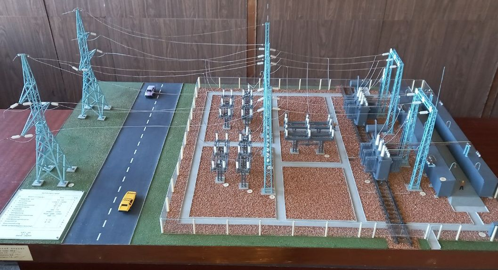

## Кафедра ЭПГ

Кафедра создана в 1968 году.
<!-- Заведует кафедрой д.т.н., профессор Бершадский Илья Адольфович.
-->

Кафедра готовит инженеров по профессиональному направлению
“Электроэнергетика и электротехника” (код 13.03.02) по профилю
“Электроснабжение и энергосбережение”:

- бакалавров;
- магистров

Ежегодно принимается 50 студентов на дневную форму обучения; имеется
также заочная форма обучения.

Кафедра выполняет научные работы в областях:

- электромагнитной совместимости и электросбережения;
- разработки методов оценки надежности и безопасности систем
  электроснабжения и прогнозирования аварий и катастроф на
  технологических объектах в период их проектирования и эксплуатации;
- проектирования систем электроснабжения промышленных предприятий.

Преподаватели кафедры проводят занятия по 26 дисциплинам.

На кафедре работают 12 преподавателей, в том числе 3 профессора, д-ра
технических наук, 7 доцентов - канд. технических наук, 1 старший
преподаватель, 1 ассистент - канд. технических наук
