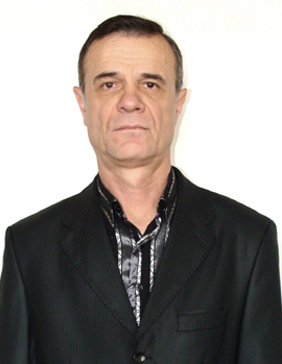

## Пожидаев Александр Александрович

Ассистент, заведующий лабораториями.

Работает в Донецком политехническом институте с 1967 г. в должности
препаратора кафедры электрических станций, а с 1969 г., когда была
основана кафедра “Электроснабжения промышленных предприятий и городов” -
препаратора кафедры ЭПГ. Закончил вечерний факультет Донецкого
политехнического института по специальности “Электроснабжение
промышленных предприятий и городов”. В 1972 г. был назначен заведующим
лаборатории кафедры ЭПГ. С первого дня основания кафедры на
Пожидаева А.А. была положена обязанность создания
материально-технической базы кафедры и участие в разработке и монтаже
лабораторных стендов по курсам дисциплин, которые преподаются на
кафедре. Осуществлял контроль за строительством и монтажом подстанций
института, быв членом штаба по строению 8 учебного корпуса. После
переезда кафедры в новые помещения построенного корпуса в сжатый термин
были смонтированы новые лаборатории, их оборудование, что привело к
увеличению лабораторной базы кафедры в 4 раза. В разное время был членом
институтских комиссий по охране труда и техники безопасности, главой
комисии народного контроля. Принимал участие в выполнении
научно-исследовательских работ кафедры, награжден серебряной медалью
ВДНТ СССР.

