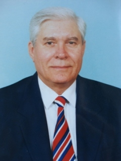

## Те, кого с нами уже нет

### Муха Валентин Павлович (1938–2010), зав. кафедрой 1995–2003 гг.

Кандидат технических наук, профессор кафедры “Электроснабжения
промышленных ппредприятий и городов” Донецкого национального
технического университета, Отличник образования Украины, выпускник
Зуевского энергетического техникума 1958 года по специальности
“Котельные, паротурбинные установки и автоматизации тепловых процессов”.

1955–1958 — учился в ЗЭТ 1958–1961 — служба в советской Армии; (Немецкая
демократическая республика) 1961–1966 — учился в Донецком
политехническом институте 1966–1968 — ассистент кафедры “Электрические
сети и системы” 1968–1971 — учился в аспирантуре в Ростовском-на-Дону
институте железнодорожного транспорта 1971–2009 — работа в должности
ассистента, старшего преподавателя, доцента и профессора кафедры
“Электроснабжения промышленных предприятий и городов” 1986–1995 — декан
вечернего факультета ДПИ (ДонНТУ) 1995–2003 — зав. кафедры
“Электроснабжения промышленных предприятий и городов” ДонНТУ 2003–2010 —
профессор кафедры “Электроснабжения промышленных предприятий и городов”
ДонНТУ.

Муха Валентин Павлович с 1966 г. по 1968 г. работал ассистентом кафедры
“Электрические сети и системы”. В период с 1968 г. по 1971 г. учился в
аспирантуре в Ростовском институте железнодорожного транспорта.
Руководителем кандидатской диссертации Мухи В.П. был всемирно известный
специалист в области моделирования электрических нагрузок на
промышленных предприятиях д.т.н. профессор Каялов Г.М. В 1975 г.
Валентин Павлович защитил кандидатскую диссертацию на тему: “Вопросы
теории и расчета электрических нагрузок и потерь напряжения в сетях
контактной электросварки” в Ереванском политехническом институте.

Основные направления его научной деятельности:

- расчет электрических нагрузок,
- компенсация реактивной мощности,
- надежность систем электроснабжения.

За время работы в ДонНТУ Валентином Павловичем было опубликовано 65
научных статей и методических пособий, получено 2 авторских
свидетельства на изобретения.

Всю свою педагогическую деятельность (с 1966 г. по 2010 г.) Валентин
Павлович посвятил обучению и воспитанию студентов, как прекрасный
методист, в совершенстве владеющий тонкостями преподавательской
деятельности, прекрасно читал лекции. По всем читаемым им дисциплинам
были лучшие конспекты лекций на кафедре ЭПГ. Валентин Павлович заслужил
уважение студентов, сотрудников кафедры, факультета, института, с
которыми ему приходилось сотрудничать в процессе трудовой деятельности.

За выдающиеся успехи в проведении учебного процесса Валентин Павлович
был награжден знаком: “Отличник образования Украины”.

### Разгильдеев Генадий Инокентьевич, зав. кафедрой 1979–1981 гг.

Заслуженный деятель науки и техники РСФСР, доктор технических наук,
профессор, академик РАЕН, академик РИА, специалист в области надежности
и безопасности систем электроснабжения горных предприятий.

Возглавлял кафедру ЭПГ в течение двух лет с 1979 г. по 1981 г.

За время работы Геннадия Иннокентьевича на кафедре ЭПГ им была
опубликована 21 научная статья, получено 12 авторских свидетельств на
изобретения и под его руководством аспирант кафедры ЭПГ Ковалев
Александр Петрович защитил кандидатскую диссертацию. Ассистент
Олейник В.Г. переведен в должность доцента кафедры ЭПГ.

В послужном списке Разгильдеева Г.И. свыше 270 печатных работ в
научно-технических изданиях, в том числе 23 монографии и учебных
пособия, им получено 40 авторских свидетельств и патентов на
изобретения. Под его руководством защищены 31 кандидатская и 4
докторских диссертаций.

В настоящее время Генадий Инокентьевич плодотворно трудится в КузГТУ на
созданной им кафедре “Электрификация и автоматизация горных работ” в
качестве профессора кафедры.

[Страница на сайте
ТПУ](http://wiki.tpu.ru/wiki/%D0%A0%D0%B0%D0%B7%D0%B3%D0%B8%D0%BB%D1%8C%D0%B4%D0%B5%D0%B5%D0%B2_%D0%93%D0%B5%D0%BD%D0%BD%D0%B0%D0%B4%D0%B8%D0%B9_%D0%98%D0%BD%D0%BD%D0%BE%D0%BA%D0%B5%D0%BD%D1%82%D1%8C%D0%B5%D0%B2%D0%B8%D1%87)

### Совпель Валерий Борисович, зав. кафедрой 1975–1979 и 1986–1995 гг.

За время руководства кафедрой кандидат технических наук, доцент Совпель
Валерий Борисович проявил себя, как мудрый и талантливый руководитель и
организатор научных исследований. На кафедре ЭПГ велись значительные
хоздоговорные работы с такими предприятиями: Авдеевский коксохимзавод
(рук. к.т.н. доц. Совпель В.Б.), Ямбургское газопромысловое управление
(Россия, рук. к.т.н. Ковалев А.П.), РЭС «Сахалинэнерго»
(г. Южносахалинск), Усть-Илимская ГЭС (рук. к.т.н. доц. Меркулов О.Н.) и
многие другие.

Общий объем хоздоговорных работ кафедры ЭПГ в разные годы колебался в
пределах 350–450 тыс.руб. в год. Научно-исследовательский сектор кафедры
насчитывал до 15 человек инженеров (самый большой на факультете).
Направление научной деятельности Совпеля В.Б. – совершенствование
методов анализа электромеханических переходных процессов в электрических
машинах и сетях. За период руководства кафедрой ЭПГ Совпелем В.Б.
опубликована 61 статья в научных журналах и получено 4 авторских
свидетельства на изобретения.

Что же касается учебного процесса, то на кафедре он был организован на
высоком методическом и научном уровне. На кафедре проводились
ежемесячные научные и методические семинары, на которых преподаватели
кафедры делились искусством проведения лекций, обсуждались и
корректировались темы лекций по читаемым курсам, дискутировались новые
научные результаты, полученные сотрудниками кафедры.

### [Джура Сергей Георгиевич](dzhura_ru.html) (1964–2020), к.т.н., доцент, зав. отделом внешних связей ДОННТУ

### [Пожидаев Александр Александрович](pozhidaev_ru.html) (1949–2022), зав. лабораториями 1972–2022 гг.
